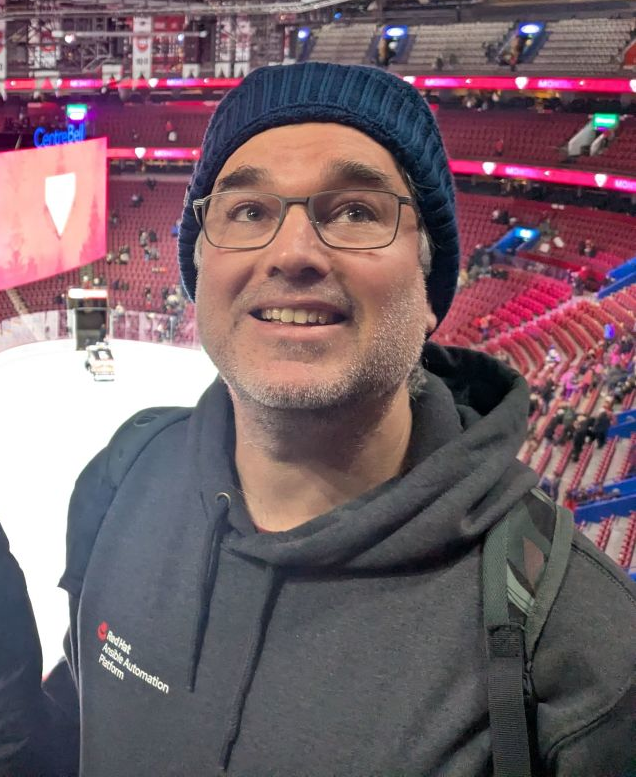

+++
title = "About"
template = "about.html"
+++

I'm Gonéri Le Bouder, and this is my personal blog where I share insights from over 15 years working in the intersection of open source technologies, cloud infrastructure, and automation.

## What I Do

I currently work on AI and automation, specifically focusing on how AI can enhance and transform the Ansible experience. My work involves developing AI-powered tools and solutions that make infrastructure automation more intelligent, accessible, and effective.

I'm also the creator and maintainer of several open source projects:

* **[Virt-Lightning](https://virt-lightning.org/)** - A lightweight CLI for libvirt that serves as an alternative to Vagrant, designed for quickly spawning VMs in development environments
* **[bsd-cloud-image.org](https://bsd-cloud-image.org/)** - A service providing cloud-ready BSD operating system images for OpenStack, cloud-init compatible environments, and testing

## What You'll Find Here

This blog covers the technical challenges and solutions I encounter.

* **AI & Automation** - How artificial intelligence enhances Ansible and infrastructure automation
* **Cloud Infrastructure & DevOps** - OpenStack, libvirt, container technologies, CI/CD pipelines, and infrastructure as code
* **Open Source Development** - Building tools, performance optimization, and system administration insights

 My posts often include retrospectives on complex projects, performance analyses with real numbers, and the kind of troubleshooting insights that only come from hands-on experience.

## Background

I've been working with Linux and open source technologies since 2009, with particular expertise in:
- Cloud and virtualization platforms
- Infrastructure automation and configuration management
- Performance optimization and troubleshooting
- Open source project development and maintenance
- Multi-platform system administration

Feel free to reach out if you have questions about any of the topics I cover, or if you're working on similar challenges in your own infrastructure.
