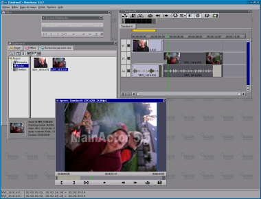

+++
title = "Mainactor 5.5"
date = 2005-05-10T01:24:00+00:00
[taxonomies]
tags = ["linux"]
+++

La société allemande [Mainconcept](http://www.mainconcept.com/) a décidé de sortir Mainactor 5.5 pour Linux. Cette sortie a été faite avant celle pour Windows. Surement une façon pour eux de se faire la publicité facilement (la preuve) en faisant parler d'eux et de tester leur nouveau logiciel de montage vidéo sur une base plus réduite d'utilisateurs.

Je viens d'essayer le logiciel, c'est la première fos que j'arrive a monter facilement un petit film sous Linux. Jusque a présent les logiciels que j'avais essayé m'imposait soit le DV ou des formats obscures pour moi, pauvre nOob de la vidéo :). Durant mon teste, je n'ai rencontré qu'un petit couâk. Un plantage durant un "Undo". Lorsque j'ai relancé le logiciel, il a restauré proprement le fichier lui même. Globalement, je reste sur une très bonne impression.
