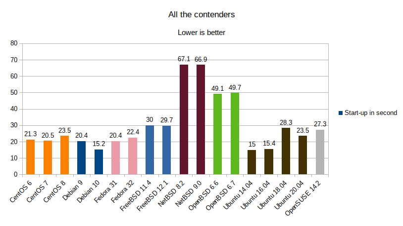
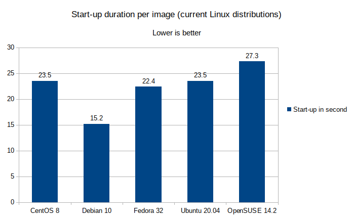
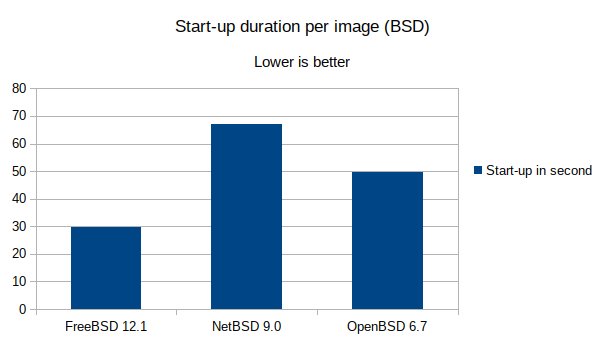
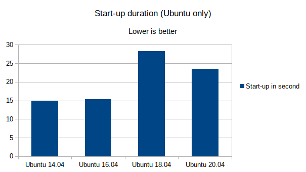

+++
title = "Cloud images, which one is the fastest?"
date = 2020-08-13T23:13:09+00:00
[taxonomies]
tags = ["linux", "bsd", "cloud", "virt-lightning", "performance"]
+++
Introduction

This post compares the start-up duration of the most popular cloud images. By start-up, I mean the time until we've got an operational SSH server.

For this test, I use a pet project called Virt-Lightning ( [https://virt-lightning.org/](https://virt-lightning.org/) ). This tool allows any Linux user to start standard cloud images locally. It will prepare the meta-data and start a VM in your local libvirt. It's very handy for people like me, who work on Linux and spend the day starting new VMs. The images are in the QCow2 format, and it uses the OpenStack meta-data format. Technically speaking, the performance should match what you get with OpenStack.

Actually, OpenStack is often slightly slower because it does some extra operations. It may need to create a volume on Ceph, or prepare extra network configuration.

The 2.0.0 release of Virt-Lightning exposes a public API. My [test scenario](https://github.com/virt-lightning/virt-lightning/blob/master/virt-lightning.org/bench_images_startup.py) is built on top of that. It uses Python to pull the different images, and create a VM from it 10 times in a row.

All the images are public; Virt-Lightning can fetch them with the `vl pull foo` command:

```shell
vl pull centos-6
```

During the boot process, the VM will set up a static network configuration, resize the filesystem, create a user, and inject an SSH key.

By default, Virt-Lightning uses a static network configuration because it's faster, and it gives better performance when we start a large number of VMs at the same time. I chose to stick with this.

I did my tests on my Lenovo T580, which comes with a NVMe storage, and 32GB of memory. I would be curious to see the results with the same scenario, but on a regular spinning disk.

The target images

For this test, I compare the following Linux distributions: CentOS, Debian, Fedora, Ubuntu, and OpenSUSE. As far as I know, there is no public cloud image available for the other common distributions. If you think I'm wrong, please post a comment below.

I also included the latest FreeBSD, NetBSD, and OpenBSD releases. They don't provide official cloud images. This is the reason why I reuse the unofficial ones from [https://bsd-cloud-image.org/](https://bsd-cloud-image.org/).

The lack of a pre-existing Windows image is the reason why this OS is not included.

Results



Debian 10 is by far the fastest image with an impressive 15s on average. Basically, 5s less than any other cloud image.



Regarding the BSDs, FreeBSD is the only system able to resize the root filesystem without a reboot. Consequently, OpenBSD and NetBSD need to start twice in a row. This explains the big difference. The NetBSD kernel hardware probe is rather slow, for instance it takes 5s to initialize the ATA bus of the CD-ROM. This is the reason why the results look rather bad.



About Ubuntu, I was surprised by the boot duration of Ubuntu 18.04. It is about two times longer than for 16.04. 20.04 is a bit better but still, we are far from the 15s of 14.04. I would be curious to know the origin of this. Maybe AppArmor?



CentOS 6 results are not really consistent. They vary between 17.9s and 25.21s. This is the largest delta if you compare with the other distribution. This being said, CentOS 6 is rather old, and won't be [supported anymore](https://wiki.centos.org/About/Product) at the end of the year.

Conclusions

All the recent Linux images are based on systemd. It would be great to extract the metrics from `systemd-analyze` to understand what impacts the performance the most.

Most of the time, when I deploy a test VM, the very first thing I do is the installation of some important packages. This scenario may be covered later in another blog post.

Raw results for each image

CentOS 6

image from: [https://cloud.centos.org/centos/6/images/CentOS-6-x86\_64-GenericCloud.qcow2](https://cloud.centos.org/centos/6/images/CentOS-6-x86_64-GenericCloud.qcow2)  
Date: Thu, 08 Aug 2019 13:28:32 GMT  
Size: 806748160

```
distro=centos-6, elapsed_time=023.20
distro=centos-6, elapsed_time=021.41
distro=centos-6, elapsed_time=024.97
distro=centos-6, elapsed_time=025.21
distro=centos-6, elapsed_time=020.29
distro=centos-6, elapsed_time=020.67
distro=centos-6, elapsed_time=020.13
distro=centos-6, elapsed_time=019.83
distro=centos-6, elapsed_time=020.09
distro=centos-6, elapsed_time=017.92
```
The average is 21.3s.

CentOS 7

image from: [http://cloud.centos.org/centos/7/images/CentOS-7-x86\_64-GenericCloud.qcow2](http://cloud.centos.org/centos/7/images/CentOS-7-x86_64-GenericCloud.qcow2)  
Date: Wed, 22 Apr 2020 12:24:07 GMT  
Size: 858783744

```
distro=centos-7, elapsed_time=020.88
distro=centos-7, elapsed_time=020.51
distro=centos-7, elapsed_time=020.42
distro=centos-7, elapsed_time=020.58
distro=centos-7, elapsed_time=020.18
distro=centos-7, elapsed_time=021.14
distro=centos-7, elapsed_time=020.74
distro=centos-7, elapsed_time=020.80
distro=centos-7, elapsed_time=020.48
distro=centos-7, elapsed_time=020.15
```

Average: 20.5s

CentOS 8

image from: [https://cloud.centos.org/centos/8/x86\_64/images/CentOS-8-GenericCloud-8.1.1911-20200113.3.x86\_64.qcow2](https://cloud.centos.org/centos/8/x86_64/images/CentOS-8-GenericCloud-8.1.1911-20200113.3.x86_64.qcow2)  
Date: Mon, 13 Jan 2020 21:57:45 GMT  
Size: 716176896

```
distro=centos-8, elapsed_time=023.55
distro=centos-8, elapsed_time=023.27
distro=centos-8, elapsed_time=024.39
distro=centos-8, elapsed_time=023.61
distro=centos-8, elapsed_time=023.52
distro=centos-8, elapsed_time=023.49
distro=centos-8, elapsed_time=023.53
distro=centos-8, elapsed_time=023.30
distro=centos-8, elapsed_time=023.34
distro=centos-8, elapsed_time=023.67
```

Average: 23.5s

Debian 9

image from: [https://cdimage.debian.org/cdimage/openstack/current-9/debian-9-openstack-amd64.qcow2](https://cdimage.debian.org/cdimage/openstack/current-9/debian-9-openstack-amd64.qcow2)  
Date: Wed, 29 Jul 2020 09:59:59 GMT  
Size: 594190848  

```
distro=debian-9, elapsed_time=020.69
distro=debian-9, elapsed_time=020.59
distro=debian-9, elapsed_time=020.16
distro=debian-9, elapsed_time=020.30
distro=debian-9, elapsed_time=020.02
distro=debian-9, elapsed_time=020.01
distro=debian-9, elapsed_time=020.71
distro=debian-9, elapsed_time=020.48
distro=debian-9, elapsed_time=020.65
distro=debian-9, elapsed_time=020.57
```

Average is 20.4s.

Debian 10

image from: [https://cdimage.debian.org/cdimage/openstack/current-10/debian-10-openstack-amd64.qcow2](https://cdimage.debian.org/cdimage/openstack/current-10/debian-10-openstack-amd64.qcow2)  
Date: Sat, 01 Aug 2020 20:10:01 GMT  
Size: 530629120

```
distro=debian-10, elapsed_time=015.25
distro=debian-10, elapsed_time=015.28
distro=debian-10, elapsed_time=014.88
distro=debian-10, elapsed_time=015.07
distro=debian-10, elapsed_time=015.39
distro=debian-10, elapsed_time=015.35
distro=debian-10, elapsed_time=015.47
distro=debian-10, elapsed_time=014.94
distro=debian-10, elapsed_time=015.57
distro=debian-10, elapsed_time=015.57
```

Average is 15.2s

Debian testing

Debian testing is a rolling release, so I won't include it in the charts, but I found interesting to include it in the results.

image from: [https://cdimage.debian.org/cdimage/openstack/testing/debian-testing-openstack-amd64.qcow2](https://cdimage.debian.org/cdimage/openstack/testing/debian-testing-openstack-amd64.qcow2)  
Date: Mon, 01 Jul 2019 08:39:27 GMT  
Size: 536621056

```
distro=debian-testing, elapsed_time=015.07
distro=debian-testing, elapsed_time=015.03
distro=debian-testing, elapsed_time=014.93
distro=debian-testing, elapsed_time=015.33
distro=debian-testing, elapsed_time=014.85
distro=debian-testing, elapsed_time=015.53
distro=debian-testing, elapsed_time=014.94
distro=debian-testing, elapsed_time=015.22
distro=debian-testing, elapsed_time=015.19
distro=debian-testing, elapsed_time=014.86
```

Average 15s

Fedora 31

image from: [https://download.fedoraproject.org/pub/fedora/linux/releases/31/Cloud/x86\_64/images/Fedora-Cloud-Base-31-1.9.x86\_64.qcow2](https://download.fedoraproject.org/pub/fedora/linux/releases/31/Cloud/x86_64/images/Fedora-Cloud-Base-31-1.9.x86_64.qcow2)  
Date: Wed, 23 Oct 2019 23:06:38 GMT  
Size: 355350528

```
distro=fedora-31, elapsed_time=020.48
distro=fedora-31, elapsed_time=020.39
distro=fedora-31, elapsed_time=020.37
distro=fedora-31, elapsed_time=020.30
distro=fedora-31, elapsed_time=020.29
distro=fedora-31, elapsed_time=020.31
distro=fedora-31, elapsed_time=020.50
distro=fedora-31, elapsed_time=020.51
distro=fedora-31, elapsed_time=020.27
distro=fedora-31, elapsed_time=020.91
```

Average 20.4s

Fedora 32

image from: [https://download.fedoraproject.org/pub/fedora/linux/releases/32/Cloud/x86\_64/images/Fedora-Cloud-Base-32-1.6.x86\_64.qcow2](https://download.fedoraproject.org/pub/fedora/linux/releases/32/Cloud/x86_64/images/Fedora-Cloud-Base-32-1.6.x86_64.qcow2)  
Date: Wed, 22 Apr 2020 22:36:57 GMT  
Size: 302841856

```
distro=fedora-32, elapsed_time=021.68
distro=fedora-32, elapsed_time=022.43
distro=fedora-32, elapsed_time=022.17
distro=fedora-32, elapsed_time=023.06
distro=fedora-32, elapsed_time=022.23
distro=fedora-32, elapsed_time=022.83
distro=fedora-32, elapsed_time=022.54
distro=fedora-32, elapsed_time=021.46
distro=fedora-32, elapsed_time=022.37
distro=fedora-32, elapsed_time=023.14
```

Average: 22.4s

FreeBSD 11.4

image from: [https://bsd-cloud-image.org/images/freebsd/11.4/freebsd-11.4.qcow2](https://bsd-cloud-image.org/images/freebsd/11.4/freebsd-11.4.qcow2)  
Date: Wed, 05 Aug 2020 01:24:32 GMT  
Size: 412895744

```
distro=freebsd-11.4, elapsed_time=030.68
distro=freebsd-11.4, elapsed_time=030.64
distro=freebsd-11.4, elapsed_time=030.29
distro=freebsd-11.4, elapsed_time=030.29
distro=freebsd-11.4, elapsed_time=029.86
distro=freebsd-11.4, elapsed_time=029.74
distro=freebsd-11.4, elapsed_time=029.90
distro=freebsd-11.4, elapsed_time=029.77
distro=freebsd-11.4, elapsed_time=030.04
distro=freebsd-11.4, elapsed_time=029.70
```

Average 30s

FreeBSD 12.1

image from: [https://bsd-cloud-image.org/images/freebsd/12.1/freebsd-12.1.qcow2](https://bsd-cloud-image.org/images/freebsd/12.1/freebsd-12.1.qcow2)  
Date: Wed, 05 Aug 2020 01:46:11 GMT  
Size: 479029760

```
distro=freebsd-12.1, elapsed_time=029.78
distro=freebsd-12.1, elapsed_time=030.32
distro=freebsd-12.1, elapsed_time=029.56
distro=freebsd-12.1, elapsed_time=029.60
distro=freebsd-12.1, elapsed_time=029.76
distro=freebsd-12.1, elapsed_time=029.89
distro=freebsd-12.1, elapsed_time=029.55
distro=freebsd-12.1, elapsed_time=029.66
distro=freebsd-12.1, elapsed_time=029.31
distro=freebsd-12.1, elapsed_time=029.77
```

Average 29.7

NetBSD 8.2

image from: [https://bsd-cloud-image.org/images/netbsd/8.2/netbsd-8.2.qcow2](https://bsd-cloud-image.org/images/netbsd/8.2/netbsd-8.2.qcow2)  
Date: Wed, 05 Aug 2020 02:06:57 GMT  
Size: 155385856

```
distro=netbsd-8.2, elapsed_time=066.71
distro=netbsd-8.2, elapsed_time=067.80
distro=netbsd-8.2, elapsed_time=067.15
distro=netbsd-8.2, elapsed_time=066.97
distro=netbsd-8.2, elapsed_time=066.84
distro=netbsd-8.2, elapsed_time=067.01
distro=netbsd-8.2, elapsed_time=066.98
distro=netbsd-8.2, elapsed_time=067.73
distro=netbsd-8.2, elapsed_time=067.34
distro=netbsd-8.2, elapsed_time=066.90
```

Average 67.1

NetBSD 9.0

image from: [https://bsd-cloud-image.org/images/netbsd/9.0/netbsd-9.0.qcow2](https://bsd-cloud-image.org/images/netbsd/9.0/netbsd-9.0.qcow2)  
Date: Wed, 05 Aug 2020 02:25:11 GMT  
Size: 149291008

```
distro=netbsd-9.0, elapsed_time=067.04
distro=netbsd-9.0, elapsed_time=066.92
distro=netbsd-9.0, elapsed_time=066.89
distro=netbsd-9.0, elapsed_time=067.24
distro=netbsd-9.0, elapsed_time=067.41
distro=netbsd-9.0, elapsed_time=067.13
distro=netbsd-9.0, elapsed_time=066.14
distro=netbsd-9.0, elapsed_time=066.75
distro=netbsd-9.0, elapsed_time=067.25
distro=netbsd-9.0, elapsed_time=066.60
```

Average: 66.9s

OpenBSD 6.6

image from: [https://bsd-cloud-image.org/images/openbsd/6.7/openbsd-6.7.qcow2](https://bsd-cloud-image.org/images/openbsd/6.7/openbsd-6.7.qcow2)  
Date: Wed, 05 Aug 2020 04:09:44 GMT  
Size: 520704512

```
distro=openbsd-6.6, elapsed_time=048.80
distro=openbsd-6.6, elapsed_time=049.72
distro=openbsd-6.6, elapsed_time=049.07
distro=openbsd-6.6, elapsed_time=048.36
distro=openbsd-6.6, elapsed_time=049.28
distro=openbsd-6.6, elapsed_time=049.12
distro=openbsd-6.6, elapsed_time=049.36
distro=openbsd-6.6, elapsed_time=049.80
distro=openbsd-6.6, elapsed_time=048.05
distro=openbsd-6.6, elapsed_time=049.71
```

Average: 49.1s

OpenBSD 6.7

image from: [https://bsd-cloud-image.org/images/openbsd/6.7/openbsd-6.7.qcow2](https://bsd-cloud-image.org/images/openbsd/6.7/openbsd-6.7.qcow2)  
Date: Wed, 05 Aug 2020 04:09:44 GMT  
Size: 520704512

```
distro=openbsd-6.7, elapsed_time=048.81
distro=openbsd-6.7, elapsed_time=048.96
distro=openbsd-6.7, elapsed_time=049.86
distro=openbsd-6.7, elapsed_time=049.12
distro=openbsd-6.7, elapsed_time=049.75
distro=openbsd-6.7, elapsed_time=050.63
distro=openbsd-6.7, elapsed_time=050.85
distro=openbsd-6.7, elapsed_time=049.92
distro=openbsd-6.7, elapsed_time=048.98
distro=openbsd-6.7, elapsed_time=050.83
```

Average: 49.7s

Ubuntu 14.04

image from: [https://cloud-images.ubuntu.com/trusty/current/trusty-server-cloudimg-amd64-disk1.img](https://cloud-images.ubuntu.com/trusty/current/trusty-server-cloudimg-amd64-disk1.img)  
Date: Thu, 07 Nov 2019 15:38:05 GMT  
Size: 264897024

```
distro=ubuntu-14.04, elapsed_time=014.40
distro=ubuntu-14.04, elapsed_time=014.42
distro=ubuntu-14.04, elapsed_time=014.94
distro=ubuntu-14.04, elapsed_time=015.44
distro=ubuntu-14.04, elapsed_time=015.64
distro=ubuntu-14.04, elapsed_time=014.59
distro=ubuntu-14.04, elapsed_time=015.02
distro=ubuntu-14.04, elapsed_time=015.22
distro=ubuntu-14.04, elapsed_time=015.44
distro=ubuntu-14.04, elapsed_time=015.44
```

Average: 15s

Ubuntu 16.04

image from: [https://cloud-images.ubuntu.com/xenial/current/xenial-server-cloudimg-amd64-disk1.img](https://cloud-images.ubuntu.com/xenial/current/xenial-server-cloudimg-amd64-disk1.img)  
Date: Thu, 13 Aug 2020 08:36:38 GMT  
Size: 309657600

```
distro=ubuntu-16.04, elapsed_time=015.13
distro=ubuntu-16.04, elapsed_time=015.39
distro=ubuntu-16.04, elapsed_time=015.42
distro=ubuntu-16.04, elapsed_time=015.62
distro=ubuntu-16.04, elapsed_time=015.29
distro=ubuntu-16.04, elapsed_time=015.60
distro=ubuntu-16.04, elapsed_time=015.62
distro=ubuntu-16.04, elapsed_time=015.21
distro=ubuntu-16.04, elapsed_time=015.62
distro=ubuntu-16.04, elapsed_time=015.67
```

Average: 15.4

Ubuntu 18.04

image from: [https://cloud-images.ubuntu.com/bionic/current/bionic-server-cloudimg-amd64.img](https://cloud-images.ubuntu.com/bionic/current/bionic-server-cloudimg-amd64.img)  
Date: Wed, 12 Aug 2020 16:58:30 GMT  
Size: 357302272

```
distro=ubuntu-18.04, elapsed_time=028.58
distro=ubuntu-18.04, elapsed_time=028.25
distro=ubuntu-18.04, elapsed_time=028.36
distro=ubuntu-18.04, elapsed_time=028.45
distro=ubuntu-18.04, elapsed_time=028.79
distro=ubuntu-18.04, elapsed_time=028.28
distro=ubuntu-18.04, elapsed_time=028.11
distro=ubuntu-18.04, elapsed_time=028.07
distro=ubuntu-18.04, elapsed_time=027.75
distro=ubuntu-18.04, elapsed_time=028.25
```

Average: 28.3s

Ubuntu 20.04

image from: [https://cloud-images.ubuntu.com/focal/current/focal-server-cloudimg-amd64.img](https://cloud-images.ubuntu.com/focal/current/focal-server-cloudimg-amd64.img)  
Date: Mon, 10 Aug 2020 22:19:47 GMT  
Size: 545587200

```
distro=ubuntu-20.04, elapsed_time=023.23
distro=ubuntu-20.04, elapsed_time=022.74
distro=ubuntu-20.04, elapsed_time=023.20
distro=ubuntu-20.04, elapsed_time=022.96
distro=ubuntu-20.04, elapsed_time=024.04
distro=ubuntu-20.04, elapsed_time=024.06
distro=ubuntu-20.04, elapsed_time=023.60
distro=ubuntu-20.04, elapsed_time=023.88
distro=ubuntu-20.04, elapsed_time=023.24
distro=ubuntu-20.04, elapsed_time=024.27
```

Average: 23.5s

OpenSUSE Leap 15.2

image from: [https://download.opensuse.org/repositories/Cloud:/Images:/Leap\_15.2/images/openSUSE-Leap-15.2-OpenStack.x86\_64.qcow2](https://download.opensuse.org/repositories/Cloud:/Images:/Leap_15.2/images/openSUSE-Leap-15.2-OpenStack.x86_64.qcow2)  
Date: Sun, 07 Jun 2020 11:42:01 GMT  
Size: 566047744

```
distro=opensuse-leap-15.2, elapsed_time=027.10
distro=opensuse-leap-15.2, elapsed_time=027.61
distro=opensuse-leap-15.2, elapsed_time=027.07
distro=opensuse-leap-15.2, elapsed_time=027.12
distro=opensuse-leap-15.2, elapsed_time=027.57
distro=opensuse-leap-15.2, elapsed_time=026.86
distro=opensuse-leap-15.2, elapsed_time=027.25
distro=opensuse-leap-15.2, elapsed_time=027.10
distro=opensuse-leap-15.2, elapsed_time=027.69
distro=opensuse-leap-15.2, elapsed_time=027.39
```

Average: 27.3s
