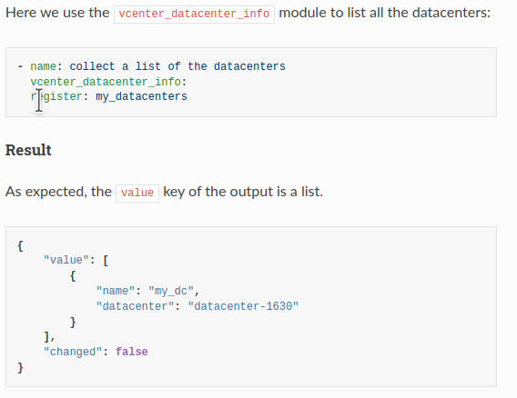

+++
title = "How we use auto-generated content in the documentation of our Ansible collection"
date = 2020-10-07T21:11:54+00:00
[taxonomies]
tags = ["ansible", "vmware"]
+++
Introduction
----------

Most of the content of the [vmware.vmware\_rest](https://galaxy.ansible.com/vmware/vmware_rest) collection is auto-generated. This article focuses on the documentation and explains how we build it.

Auto-generated example blocks
----------

This collection comes with an exhaustive series of functional tests. Technically speaking, these tests are simply Ansible playbooks that we run with ansible-playbook. They should run all the modules and ideally in all the potential scenarios (e.g.: create, modify, delete). If the playbook execution is successful, the test passes and we assume the modules are in a consistent state.

We cannot easily generate all documentation content manually, but these playbooks are an interesting source of inspiration since they actually cover and go beyond all the use cases that we want to document.

Our strategy is to record all the tasks and their results in a directory. Our documentation will just point to this content. This provides two interesting benefits:

* We know our examples work fine because it's actually the output of the CI.
* When the format of a result changes, our documentation will take it into account automatically.

We import these files into our git repository, git diff shows us the difference between the previous version. It's an opportunity to spot a regression.

[](cooking.png) Cooking the collection

How do we collect the tasks and the results?
----------

For this, we use a callback plugin ( [https://github.com/goneri/ansible-collection-goneri.utils](https://github.com/goneri/ansible-collection-goneri.utils) ). The configuration is done using three environment variables:

* `ANSIBLE_CALLBACK_WHITELIST=goneri.utils.collect_task_outputs`: Ask Ansible to load the callback plugin.
* `COLLECT_TASK_OUTPUTS_COLLECTION=vmware.vmware_rest`: Specify the name of the collection.
* `COLLECT_TASK_OUTPUTS_TARGET_DIR=/somewhere`: Target directory where to write the results.

When we finally call the `ansible-playbook` command, the callback plugin will be loaded, record all the interactions of the vmware.vmware\_rest modules, and store the results in the target directory.

The final script looks like this:

```
#!/usr/bin/env bash
set -eux

export ANSIBLE_CALLBACK_WHITELIST=goneri.utils.collect_task_outputs
export COLLECT_TASK_OUTPUTS_COLLECTION=vmware.vmware_rest
export COLLECT_TASK_OUTPUTS_TARGET_DIR=$(realpath ../../../../docs/source/vmware_rest_scenarios/task_outputs/)
export INVENTORY_PATH=/tmp/inventory-vmware_rest
source ../init.sh
exec ansible-playbook -i ${INVENTORY_PATH} playbook.yaml
```

The documentation
----------

Like many Python projects, Ansible uses [ReStructuredText](https://en.wikipedia.org/wiki/ReStructuredText) for its documentation. To include our samples we use the `literalinclude` directive. The result looks like that, the includes are done on lines 3 and 8:

```
Here we use ``vcenter_datastore_info`` to get a list of all the datastores:

.. literalinclude:: task_outputs/Retrieve_a_list_of_all_the_datastores.task.yaml

Result
------

.. literalinclude:: task_outputs/Retrieve_a_list_of_all_the_datastores.result.json

```

This is how the final result looks like:



And the RETURN blocks?
----------

Each Ansible module is supposed to come with a RETURN block ( [https://docs.ansible.com/ansible/latest/dev\_guide/developing\_modules\_documenting.html#documentation-block](https://docs.ansible.com/ansible/latest/dev_guide/developing_modules_documenting.html#documentation-block) ) that describe the output of the module. Each key of the module output is documented in this JSON structure.  
The RETURN section and the task result above should be consistent. We can actually reformat the result and generate a JSON structure that matches the RETURN block expectation.  
Once this is done, we just need to inject the content in the module file.

We reuse the task results in our modules with the following command:

```
./scripts/inject_RETURN.py ~/.ansible/collections/ansible_collections/vmware/vmware_rest/docs/source/vmware_rest_scenarios/task_outputs/ ~/git_repos/ansible-collections/vmware_rest/ --config-file config/inject_RETURN.yaml
```
