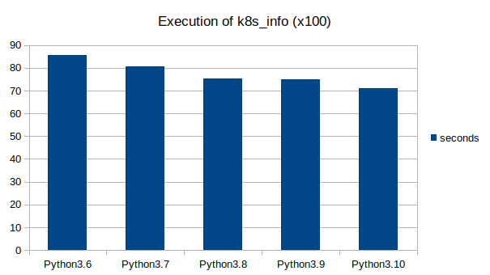

+++
title = "Ansible: Performance Impact of the Python version"
date = 2020-11-26T20:01:54+00:00
+++
Until recently, I was not really paying attention to the version of Python I was using with Ansible, as long as it was Python 3. The default version was always good enough for Ansible.

During the last few weeks, I spent the majority of my time working on the performance of the community.kubernetes collection. The modules of this collection depend on a large library (OpenShift SDK) and Python needs to reload it before every task execution. The goal was to benefit from what is already in place with vmware.vmware\_rest: [See: my AnsibleFest presentation](/posts/2020/10/how-to-speed-up-your-api-client-modules/).

While working on this, I realized that my metrics were not consistent; I was not able to reproduce some test cases from 2 months ago. After a quick investigation, the Python version matters much more than expected.

To compare the different Python versions, I decided to run some tests.

The target host is a t2.medium instance (2 vCPUs, 4GiB) running on AWS. The operating system is Fedora 33, which is really handy for this because it includes all the Python versions from 3.6 to 3.10!

I use the latest stable version of Ansible (2.10.3) that I install with `pip` in a Python virtual environment. [Here is the list of dependencies present in the virtualenvs.](https://gist.github.com/goneri/721160564904c5c0f35a1b47736ada58)

Finally, I deploy Kubernetes on [Podman](https://podman.io/) with [Kubernetes Kind](https://kind.sigs.k8s.io/).

For the first test, I use a Python one-liner to evaluate the time Python takes to load the OpenShift SDK. This is one of the operations I want to optimize for my work, so it matters a lot to me.

https://gist.github.com/goneri/c4f8ec63d0c51f7e6236173b2c60db66

Here, the loading is done 100 times in a row.

The result shows a steady improvement of the performance since Python 3.6.

|          |Python3.6|Python3.7|Python3.8|Python3.9|Python3.10|
|----------|---------|---------|---------|---------|----------|
|time (sec)| 48.401  | 45.088  | 41.751  | 40.924  |  40.385  |

With this test, the loading of the SDK is **16.5% faster** with Python 3.10.

The next test does the same thing, but this time through Ansible. My test uses the following playbook:

https://gist.github.com/goneri/ad252e30d48cfea99aaeb2e18736303e

It runs the `k8s_info` module 100 times in a row. In addition, I use an `ansible.cfg` with the following content. This way, ansible-playbook returns a nice output of the task execution duration:

https://gist.github.com/goneri/e364c17d6344fd4cd11c1ed2e0ba12ce

|          |Python3.6|Python3.7|Python3.8|Python3.9|Python3.10|
|----------|---------|---------|---------|---------|----------|
|time (sec)|  85.5   |  80.5   |  75.35  |  75.05  |  71.19   |

It's a **16.76%** boost between Python 3.6 and Python 3.10. I was not expecting such tight correlation between the two tests.

While Python is obviously not the fastest technology out there, it's great to see how its performance improves with each release. Python 3.10 is not even released yet and looks promising.

If your playbooks use some modules with dependencies on large Python libraries, it may be interesting to try the latest Python versions.

And for those who are still running Python 2.7, I get a **49.2%** performance boost between 2.7 and 3.10.
