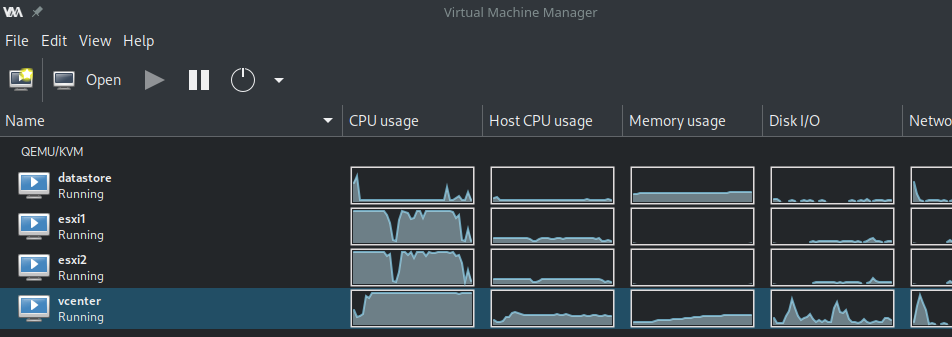

+++
title = "Ansible: How we prepare the vSphere instances of the VMware CI"
date = 2020-12-14T19:22:08+00:00
+++
As briefly explained in [CI of the Ansible modules for VMware: a retrospective](https://goneri.lebouder.net/2020/08/21/vmware-ci-of-ansible-modules-a-retrospective/), the Ansible CI uses OpenStack to spawn ephemeral vSphere labs. Our CI tests are run against them.

A full vSphere deployment is a long process that requires quite a lot of resources. In addition to that, vSphere is rather picky regarding its execution environment.

The CI of the VMware modules for Ansible runs on OpenStack. Our OpenStack providers use KVM-based hypervisors. They expect images in the [qcow2 format](https://en.wikipedia.org/wiki/Qcow).

In this blog post, we will explain how we prepare a cloud image of vSphere (also called a golden image).

[](image.png)a full lab running on libvirt

First, get a large ESXi instance
----------

The vSphere (VCSA) installation process depends on an ESXi. In our case, we use [a script](https://github.com/virt-lightning/esxi-cloud-images) and [Virt-Lightning](https://virt-lightning.org/) to prepare and run an ESXi image on Libvirt. But you can use your own ESXi node as long as it meets the following minimal constraints:

* 12GB of memory
* 50GB of disk space
* 2 vCPUs

Deploy the vSphere VM (VCSA)
----------

For this, I use my own role called [goneri.ansible-role-vcenter-instance](https://github.com/goneri/ansible-role-vcenter-instance). It delegates the deployment to the `vcsa-deploy` command. As a result, you don't need any human interaction during the full process. This is handy if you want to deploy your vSphere in a CI environment.

At the end of the process, you've got a large VM running on your ESXi node.

In my case, all these steps are handled by the following playbook: [https://github.com/virt-lightning/vcsa\_to\_qcow2/blob/master/install\_vcsa.yml](https://github.com/virt-lightning/vcsa_to_qcow2/blob/master/install_vcsa.yml)

Tune-up the instance
----------

Before you shut down the freshly created VM, you would like to make some adjustments.
I use the following playbook for this: [prepare\_vm.yml](https://github.com/virt-lightning/vcsa_to_qcow2/blob/master/prepare_vm.yml)

During this step, I ensure that:

* [Cloud-Init](https://cloud-init.io/) is installed,
* the root account is enabled with a real shell,
* the virtio drivers are available

Cloud-Init is the de-facto tool that handles all the post-configuration tasks that we can expect from a Cloud image: inject the user SSH key, resize the filesystem, create a user account, etc.

By default, the vSphere VCSA comes with many disks, which is a problem in a cloud environment where an instance is associated with a single disk image.
So I also move the content of the different partitions to the root filesystem and adjust the /etc/fstab to remove all the references to the other disks. This way I will be able to maintain only one qcow2 image.

All these steps are handled by the following playbook: [prepare\_vm.yml](https://github.com/virt-lightning/vcsa_to_qcow2/blob/master/prepare_vm.yml)

Prepare the final Qcow2 image
----------

At this stage, the VM is still running, so I shut it down.
Once this is done, I extract the raw image of the disk using the curl command:

```
curl -v -k --user 'root:!234AaAa56' -o vCenterServerAppliance.raw 'https://192.168.123.5/folder/vCenter-Server-Appliance/vCenter-Server-Appliance-flat.vmdk?dcPath=ha%252ddatacenter&dsName=l
ocal'
```

* `root:!234AaAa56` is my login and password
* `vCenterServerAppliance.raw` is the name of the local file
* `192.168.123.5` is the IP address of my ESXi
* vCenter-Server-Appliance is the name of the vSphere instance. `vCenter-Server-Appliance-flat.vmdk` is the associated raw disk

The local .raw file is large (50GB), so ensure you've got enough free space.

You can finally convert the raw file to a qcow2 file. You can use Qemu's [qemu-img](https://www.qemu.org/docs/master/interop/qemu-img.html) for that, it will work fine but the image will be monstrously large. I instead use [virt-sparsify](https://libguestfs.org/virt-sparsify.1.html) from the [libGuestFS](https://libguestfs.org) project. This command will reduce the size of the image to the bare minimum.

```
virt-sparsify --tmp tmp --compress --convert qcow2 vCenterServerAppliance.raw vSphere.qcow2
```

Conclusion
----------

You can upload the image in your OpenStack project with the following command:

```
openstack image create --disk-format qcow2 --file vSphere.qcow2 --property hw_qemu_guest_agent=no vSphere
```

If your OpenStack provider uses Ceph, you will probably want to reconvert the image to a flat raw file before the upload. With vSphere 6.7U3 and before, you need to force the use of a e1000 NIC. For that, add `--property hw_vif_model=e1000` to the command above.

I've just done the whole process with vSphere 7.0.0U1 in 1h30 (Lenovo T580 laptop). I use the `./run.sh` script from [https://github.com/virt-lightning/vcsa\_to\_qcow2](https://github.com/virt-lightning/vcsa_to_qcow2), which automates everything.

The final result is certainly not supported by VMware, but we've already run hundreds of successful CI jobs with this kind of vSphere instances. The CI prepares a fresh CI lab in around 10 minutes.
