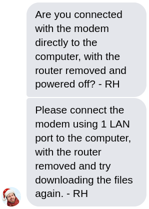

+++
title = "How to waste a Friday..."
date = 2021-01-24T00:14:24+00:00
[taxonomies]
tags = ["networking", "linux"]
+++
Yesterday morning I got frustrated by a really slow download speed of some files. What should have taken seconds with my 400 Mb/s connection actually took more than 16 minutes. In addition, I was able to reproduce the problem on my router.

Here, the curl statistics show a 26:52 minute download at 415kb/s:

```
$ curl -o /dev/null https://s3.us-east-2.amazonaws.com/zuul-images/fedora-open-vm-tools-livecd.iso% Total % Received % Xferd Average Speed Time Time Time Current Dload Upload Total Spent Left Speed 0 627M 0 2684k 0 0 398k 0 0:26:52 0:00:06 0:26:46 415k^C
```

Just to be sure, I retried with a lower MTU. The issue remained. Two friends in Montréal also confirmed everything worked well for them.

My laptop uses a wired connection that I've been using for years now. A large part of the population works from home and the Internet is under constant pressure. So I suspected an ISP bandwidth limitation to preserve the Quality of Service. I contacted them and ... complained... a lot.

[](teksavvy1.png)

At some point, the technician managed to get my attention and asked me to connect the modem directly to my laptop.

This is an obviously pointless request since the downloads are also slow from the router. But well, if I want them to act, I also need to be cooperative. I gave it a try and... I immediately felt embarrassed. It was damn fast! The download speed was actually even above the 400 Mb/s ceiling. WTF.

So I started to reconsider my whole life in a deep introspection. How can this be real? My router runs OpenBSD 6.7 with an absolutely basic pf configuration. Its hardware is decent (Intel(R) Core(TM) i3-2120 CPU @ 3.30GHz). The router is connected to the modem with a very common Realtek RTL8125 and the LAN is connected to an Intel I350. I can download large files between my laptop and the router at full speed.

All this ruled out my laptop, the ethernet cable, and the router's I350. The last potential culprit was the Realtek NIC. I replaced it with another Intel I350 and retried. Same problem. The downloads were still slow on my laptop and the router. The Realtek NIC was innocent.

So I started thinking. Why is the rest of the family not really affected by the poor performance of the Internet connection? And so, I tried to download the same file from another computer. And it was fast... Damn, what's going on? I switched some ports of the switch just to be sure. The problem was now between my laptop and the ethernet cable.

My laptop uses a bonding of the [WiFi and the wired connection](https://fedoramagazine.org/bond-wifi-and-ethernet-for-easier-networking-mobility/). This gives me the ability to move around with the laptop without losing all my open connections. For instance, I can remove my ethernet cable in the middle of a meeting and the laptop will use the WiFi seamlessly. But well, I digress. I removed this special configuration. And... the problem remained.

But during this last check, I also saw a large number of RX errors associated with the laptop NIC. Interesting; let me try another NIC. I plugged in a USB 3.0 Realtek RTL8156 NIC and this time... it worked.

The ethernet cable is a CAT6 cable and is not that long (20m), but it seemed like the NIC (Intel I219-LM) of my T580 was a bit picky with the quality of the signal. It could also be a problem with the e1000e driver of the new 5.10 kernel. The cable was good, I had just tested it. Anyway, I put a switch just before my laptop NIC and everything works great now.

I'm still not sure why my downloads are still slow on OpenBSD. But this is an adventure for another day. The slow downloads were all with HTTPS sites (S3 and a Caddy website), the DF flag was on (TCP Don't Fragment) which exacerbated the impact of the transmission errors.

I found the whole situation to be interesting. It's a series of wrong assumptions and the solution is really far from what I would have imagined.

Also, thank you Teksavvy for your great support.

Update: [this](https://www.snellman.net/blog/archive/2017-07-20-s3-mystery/) partially explains the OpenBSD S3 download problem.

Update 2: I'm now running Linux 5.10.11 and... I don't see any RX errors anymore! The S3 download is just as fast as it should be. So this was indeed a problem with the e1000e driver.

Update 3: The problem is back, I'm not sure if it's a hardware limitation of the NIC itself. I now use the Realtek NIC all the time.
