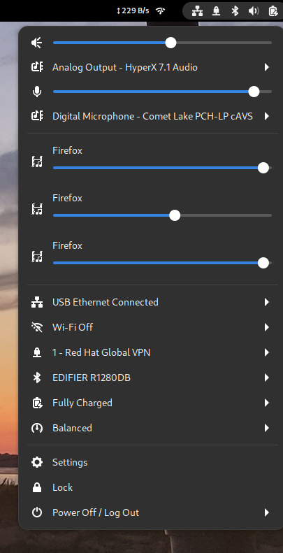

+++
title = "My GNOME configuration and its extensions"
date = 2022-11-12T02:40:48+00:00
[taxonomies]
tags = ["linux", "gnome"]
+++
I've been using a slightly tweaked GNOME 3 for a while now. Before that, I was using the [Awesome Window Manager](https://awesomewm.org/) and I was quite fond of the key bindings. In order to facilitate the transition, I tried to recreate them. The result is pretty good. I can navigate between my 9 different virtual desktops using the Windows (a.k.a. SUPER) key + a number. Windows + F also works; it will turn on fullscreen mode for a given window. Years after the migration to GNOME, I still use the bindings extensively. The following script configures GNOME with my configuration: [https://gist.github.com/goneri/b57a96915ea4a98f81df3bb57a41913e](https://gist.github.com/goneri/b57a96915ea4a98f81df3bb57a41913e)

It creates 9 virtual desktops on one single monitor that I can reach using the Super + $number key binding, e.g.: Windows + 6. In addition, it turns off the animations and the annoying alert sound.

I also use a couple of extensions:

* **Application volume mixer** to be able to adjust my mic volume level during meetings [link](https://extensions.gnome.org/extension/3499/application-volume-mixer/)
* **Network stats** to get some visibility on the network traffic [link](https://extensions.gnome.org/extension/4308/network-stats/)
* **Sound Output Device Chooser** to be able to switch the sound output between my Bluetooth speaker and my headset. I use it several times every day; it's super handy. [link](https://extensions.gnome.org/extension/906/sound-output-device-chooser/)

