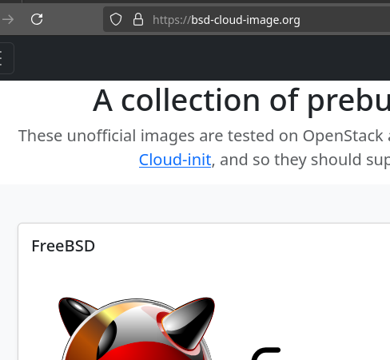

+++
title = "bsd-cloud-image.org 2nd^w3rd  rewrite"
date = 2024-11-04T15:28:50+00:00
+++
[bsd-cloud-image.org](https://bsd-cloud-image.org/) aims to simplify the use of BSD operating systems in a cloud environment. It provides a series of cloud-ready images that can quickly be deployed and tested. The original target was [OpenStack](https://www.openstack.org/) and [Virt-Lightning](https://virt-lightning.org/). But the images should work with any [Cloud-Init](https://cloud-init.io/) compatible environment.

Yesterday I released a new version of the website based on [TypeScript](https://www.typescriptlang.org/) + [Vite](https://vite.dev/) + [VueJS](https://vuejs.org/) and Bootstrap 5. After 5 years, the original static page was due for a rewrite. The definition of the images was lost deep inside a mix of HTML code and Bootstrap class names. It's now isolated in a [clear JSON file](https://github.com/goneri/bsd-cloud-image.org/blob/main/src/images_data.json). This will simplify the maintenance in the long run. It should also be easier to add new features. I'm dreaming about a way to spawn instances directly from the interface.

Fun fact: I had a v2 rewrite [mostly done](https://github.com/goneri/bci-v2) that I never published. It's based on [Elixir](https://elixir-lang.org/), and it was super fun to do. It's not a static website since it runs on top of the Erlang VM, I'm afraid the maintenance may be a source of extra complexity and I'm not sure this is the right strategy considering my limited free time.

I also pushed new FreeBSD and NetBSD images recently. I still need to prepare the NetBSD 10 build.

Enjoy!

