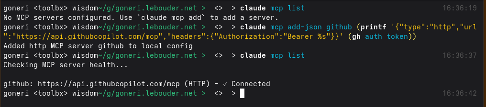

+++
title = "Claude and Github MCP tools"
date = 2026-01-12T16:23:59+00:00
[taxonomies]
tags = ["tips", "llm"]
+++


You already use Github with the `gh` command and want to enable the [MCP service in Claude Code](https://github.com/github/github-mcp-server/blob/main/docs/installation-guides/install-claude.md).

In this case, you don't need to prepare a new Github Personal Access Token, but you can just
reuse the `gh`'s token that `gh auth token` returns:


With [Fishshell](https://fishshell.com/), this looks like this:

```shell
claude mcp add-json github -- (printf '{"type":"http","url":"https://api.githubcopilot.com/mcp","headers":{"Authorization":"Bearer %s"}}' (gh auth token))
```

or Bash:

```shell
claude mcp add-json github "$(printf '{"type":"http","url":"https://api.githubcopilot.com/mcp","headers":{"Authorization":"Bearer %s"}}' "$(gh auth token)")"
```



