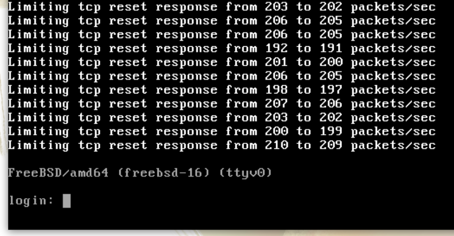

+++
title = "FreeBSD 15 comes with an official Cloud image"
date = 2026-01-10T14:23:51+00:00
+++

I've been maintaining [bsd-cloud-image.org](https://bsd-cloud-image.org/) since 2019. The website
gives access to cloud images for BSD operating systems. The images are in QCOW2 format and include
cloud-init. You can for instance use them with OpenStack or [Virt-Lightning](https://virt-lightning.org),
my second pet-project.

I maintain these images because these projects don't provide anything like this and I want to provide
a way to quickly try the BSDs, without the hassle of a manual installation.
FreeBSD 15.0 was released in December, and I was happy to discover that the project already provides cloud images!

The FreeBSD images of [bsd-cloud-image.org](https://bsd-cloud-image.org/) will no longer be updated. A message
now redirects users to the official images.

FreeBSD uses its own cloud-init implementation called [NuageInit](https://man.freebsd.org/cgi/man.cgi?query=nuageinit&sektion=7&n=1). It's a minimalistic implementation
in Lua that is pretty elegant and straightforward.

In order to get the image to work properly with Virt-Lightning, I had to push a couple of commits. Thanks to
Baptiste Daroussin, they were all quickly accepted. This was my first contribution to FreeBSD and it was a super
positive experience.

