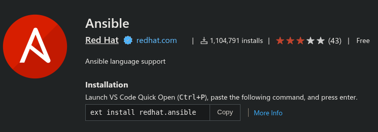

+++
title = "Run VSCode-Ansible tests locally"
date = 2026-01-13T12:06:48+00:00
+++

This is about development of the [Ansible extension for VSCode](https://marketplace.visualstudio.com/items?itemName=redhat.ansible). 

The Git repository is hosted on Github [ansible/vscode-ansible](https://github.com/ansible/vscode-ansible) and
I always have a hard time to run the CI tests locally. I took some notes.



First, I use [FishShell](https://fishshell.com/) and you will need to adjust some commands if you
use Bash or Zsh.

1. First you need `lsof`, `uv` and `go-task`. A `task` symlink is also needed to keep the original
  upstream name of [Go-Task](https://taskfile.dev/):

    ```shell
    sudo dnf install -y lsof uv go-task unzip
    ln -s /bin/go-task /usr/local/bin/task
    ```

2. Next, is to ignore Docker, since I only use Podman:

    ```shell
    export SKIP_DOCKER=1
    ```

3. I need to create a venv with Python 3.13 (for now) and it has to be in `~/.local/share/virtualenvs`:

    ```shell
    uv venv --python 3.13 ~/.local/share/virtualenvs/vsa
    source ~/.local/share/virtualenvs/vsa/bin/activate.fish
    ```

    In order to avoid some warnings later, you can also populate the venv with the following Ansible tools:

    ```shell
    uv pip install ade-python ansible-core ansible-creator ansible-lint ansible-navigator molecule
    ```

4. I also want `node_modules/.bin` in my `$PATH`:

    ```shell
    set -x PATH $PATH $PWD/node_modules/.bin
    ```

5. I can run the linter commands with: `task lint`

6. And the end to end tests with: `task e2e`
