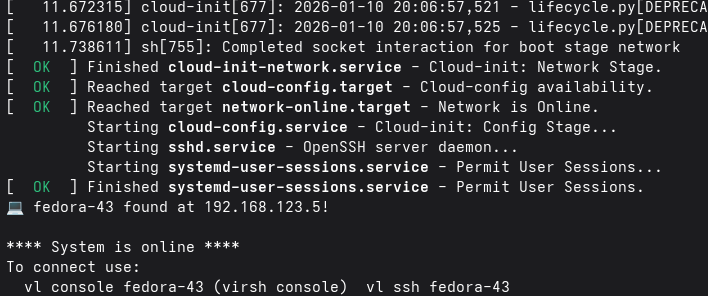

+++
title = "Virt-Lightning 2.5.0"
date = 2026-01-10T14:59:09+00:00
+++

I just published [Virt-Lightning 2.5.0](https://virt-lightning.org/). The tool aims to give
Linux users a way to quickly spawn cloud images locally. The user interface is a CLI
and its philosophy is inspired by similar tools like the OpenStack CLI, ec2 command, Podman
or Docker.

For instance, if you want to run the latest snapshot of Fedora 43, you can just install `uv` and run:

```shell
uvx virt-lightning start fedora-43 --memory 2048
```



## What's new in 2.5.0

This release brings several improvements to image management:

- **Renamed commands**: `fetch` is now `pull`, `distro_list` is now `images`, and `remote_images` list all the images ready to be downloaded. Overall, this gives a more intuitive CLI experience.
- **Pull images from any URL**: You can now create new local image (distro) directly from an image URL.
- **Cloud-init user data**: Exposed the `packages` and `write_files` configuration options for more flexible VM customization.

Here are some examples:

List available images:

```shell
uvx virt-lightning images
```

Pull an image from a custom URL:

```shell
uvx virt-lightning pull --url https://example.com/my-image.qcow2 my-custom-image
```

Start a VM with additional packages:

```shell
uvx virt-lightning start fedora-43 --packages vim,htop
```

Thanks to [Jim McCann](https://github.com/jimccann-rh) for his code contribution.
